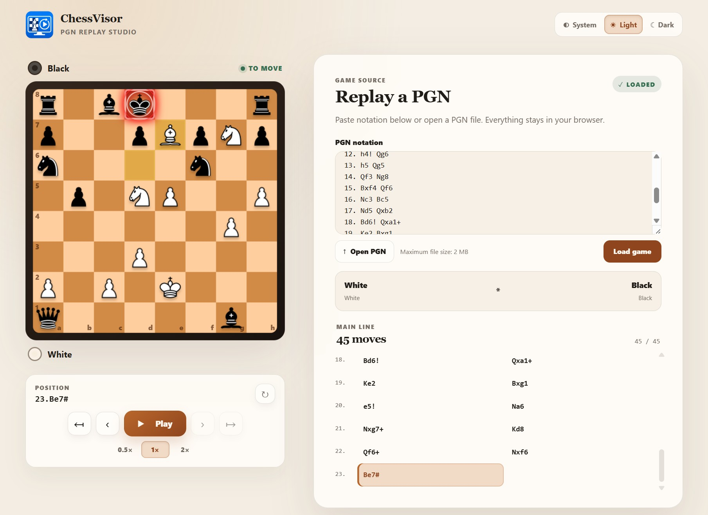
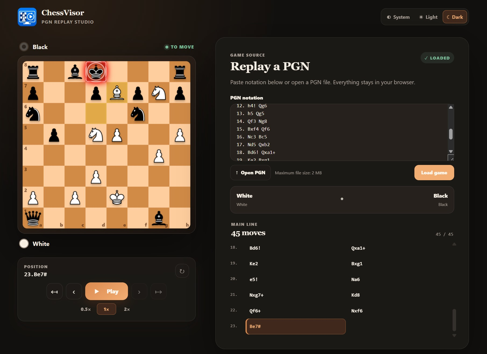

# ChessVisor

ChessVisor is a browser-based PGN replay studio. Paste or open a chess game, then step through every legal move on an animated board while keeping the notation, comments, players, and game result in view.

It is built as a .NET 10 Blazor WebAssembly progressive web app, so replaying a game happens entirely in the browser.

## Highlights

- Load PGN from pasted notation or a `.pgn` file (up to 2 MB).
- Replay the main line with animated moves, restart/previous/next/end controls, and 0.5×, 1×, or 2× playback.
- Jump directly to any move from the notation list and flip the board at any time.
- Preserve PGN headers, results, comments, annotations, and custom starting positions defined with `SetUp`/`FEN`.
- Validate PGN and show actionable, source-aware errors for illegal moves and malformed notation.
- Use System, Light, or Dark themes; the selection is remembered locally.
- Install it as a PWA where supported.

Keyboard shortcuts: focus the board, then use <kbd>←</kbd>/<kbd>→</kbd> to move backward/forward and <kbd>Space</kbd> to play or pause.

## Screenshots

| Light mode | Dark mode |
| --- | --- |
|  |  |

## Run locally

Prerequisites: the [.NET 10 SDK](https://dotnet.microsoft.com/download/dotnet/10.0).

```powershell
dotnet restore ChessVisor.slnx
dotnet run --project ChessVisor/ChessVisor.csproj
```

Open the local URL printed by the development server.

## Test and publish

```powershell
dotnet test ChessVisor.slnx --configuration Release
dotnet publish ChessVisor/ChessVisor.csproj --configuration Release --output publish
```

The repository includes a GitHub Actions workflow that tests and publishes the app to GitHub Pages when changes are pushed to `master`.

## Project structure

| Path | Purpose |
| --- | --- |
| `ChessVisor/` | Blazor WebAssembly UI, chessboard, themes, and PWA assets. |
| `Chess.Core/` | Chess rules, FEN handling, and PGN parsing/replay models. |
| `Chess.Core.Tests/` | Unit tests for PGN parsing and chess-rule behavior. |
| `Docs/` | Project screenshots used in this README. |
