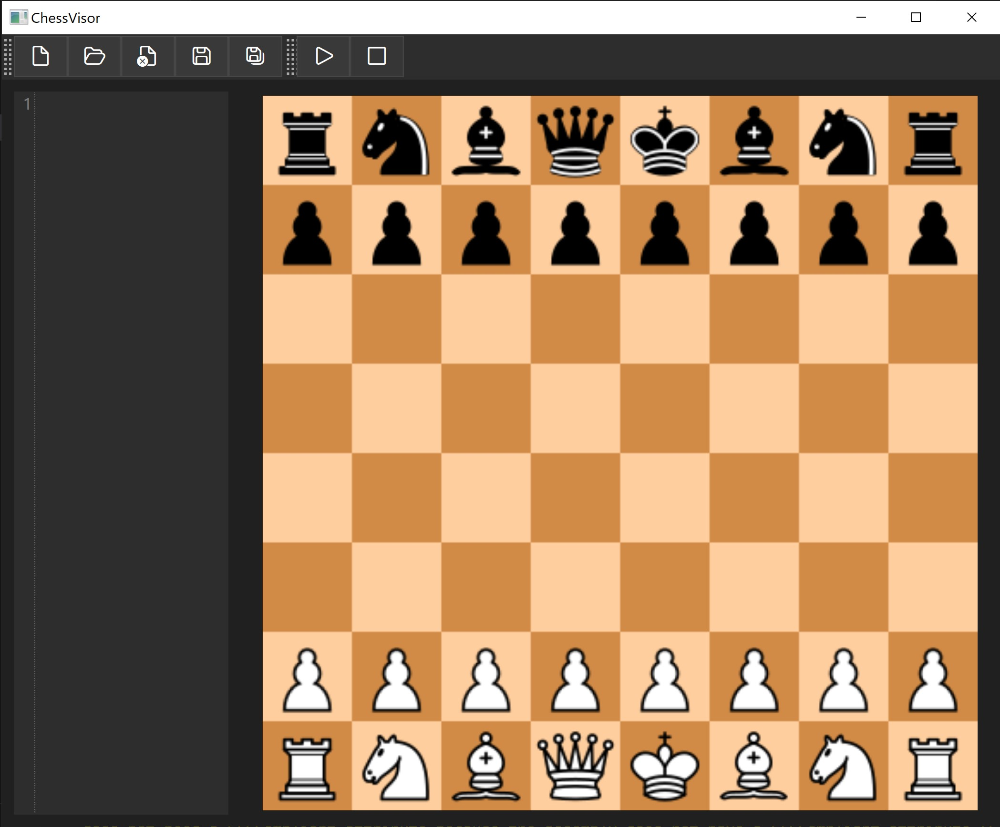

ChessVisor
==========

ChessVisor is a WPF application that simulates the moves in a chess game. The algebraic notation of a chess game can be entered into the built-in text editor, and the game is simulated on the on-screen chess board.

Screenshot
----------

Parser
------

Antlr4 is used to parse the algebraic notation. The parser is in the `ChessParser` directory.